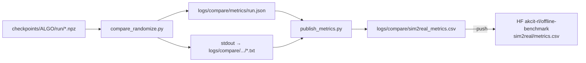

# `scripts/` — avaliação sim2real (SRR) e relatórios

Conjunto de utilitários usados fora do loop de treino: avaliar um checkpoint sob
perturbações de dinâmica/observação, agregar os resultados em uma tabela publicável e
inspecionar a cobertura de seeds no wandb.

## Pipeline



Os runners (`run_srr_eval.sh`, `run_srr_phases.sh`, `run_compare_randomize_all.sh`) são
apenas laços em cima de `compare_randomize.py` com política de *resume*.

## Pré-requisitos

| Item | Observação |
| --- | --- |
| `MINARI_DATASETS_PATH` | Precisa apontar para `CORL/datasets` para resolver `playground/...`. Os runners `.sh` já exportam. |
| GPU / EGL | `compare_randomize.py` força `MUJOCO_GL=egl` e cria o contexto GL antes de importar JAX. |
| Interpretador | Os runners usam `.venv/bin/python` (ou `uv run`, em `run_compare_randomize_all.sh`). |
| `WANDB_API_KEY` | Só para `wandb_seed_matrix.py`. |
| Login no Hugging Face | Só para `publish_metrics.py --push` (repo **privado**). |

---

## `compare_randomize.py`

Avalia um checkpoint em cada suíte de randomização selecionada e grava um JSON com as
métricas e os retornos por episódio.

```bash
export MINARI_DATASETS_PATH="$PWD/datasets"
.venv/bin/python -m scripts.compare_randomize \
  --checkpoint_path checkpoints/BC/BC-Go2JoystickFlatTerrain-59e9c78e \
  --device cuda --n_actors 50 --n_episodes 100 \
  --configs humanoid_gym_medium
```

### Flags

| Flag | Padrão | Descrição |
| --- | --- | --- |
| `--checkpoint_path` | — | Diretório do run **ou** um `.npz` específico (permite varrer checkpoints intermediários). Num diretório usa `checkpoint_final.npz`, senão o de maior passo. |
| `--checkpoint_config` | `None` | `config.yaml` alternativo. Sem ele, lê o `config.yaml` ao lado do checkpoint. |
| `--n_actors` | `4` | Ambientes vetorizados (limitado a `n_episodes`). Menos lotes = mais rápido. |
| `--n_episodes` | `20` | Episódios por suíte. |
| `--seed` | `0` | — |
| `--render` | `False` | Salva vídeo em `videos/<checkpoint>/<suite>-<timestamp>.mp4`. |
| `--device` | `cuda` | — |
| `--configs` | `None` (todas) | Lista separada por vírgula de suítes. `default` entra **sempre** como baseline. |
| `--metrics_dir` | `logs/compare/metrics` | Destino do JSON. |
| `--dt_target_return` | `None` | Só DT: sobrepõe `target_returns[0]` do config do run. |

Do `config.yaml` do checkpoint são lidos `env`, `command_type`, `dataset_id` e `seed`
(o DT chama o primeiro de `env_name`; os dois nomes são aceitos). A arquitetura do ator
**não** é lida do config — vem dos próprios pesos. A única exceção é o DT, cujo
transformer não é reconstruível a partir da árvore de pesos: dele também são lidos
`seq_len`, `episode_len`, `reward_scale`, `target_returns`, `embedding_dim`,
`num_layers`, `num_heads` e os três dropouts.

### Suítes disponíveis

| Nome | Origem | Papel |
| --- | --- | --- |
| `default` | env nominal | Baseline do SRR (com ruído de sensor nativo). |
| `disabled` | sem ruído | Piso de ruído do protocolo. |
| `full`, `only_domain` | randomizador do Playground | Fracos demais para stress test. `only_domain` usa `disabled` como baseline. |
| `example` | `configs/randomize/example.yaml` | Suíte de exemplo. |
| `humanoid_gym` | `configs/randomize/humanoid_gym.yaml` | Degrau "strong" (Tabela III do paper). |
| `humanoid_gym_medium` | `configs/randomize/humanoid_gym_medium.yaml` | **Degrau primário** de avaliação. |

### Métricas por suíte

`score`, `score_std`, `score_median`, `n_episodes`, `srr` (= score / baseline), `gap`,
`delta_mean`, `p5_delta`, `p5_retention`, `critical_rate_10`, `critical_rate_50`,
`srr_ci_low`, `srr_ci_high` (bootstrap pareado, 1000 reamostragens, requer `scipy`).

O score é normalizado no padrão D4RL (`return_min`/`return_expert` da metadata do Minari)
quando o config traz `dataset_id`; sem ele, são retornos brutos e o script avisa.

### Saída

`logs/compare/metrics/<run>.json`, onde `<run>` é o nome do diretório do checkpoint, ou
`<diretório>@<passo>` quando o alvo é um `.npz` intermediário. O JSON guarda também
`episode_returns` por suíte, para recomputar métricas sem simular de novo.

### Reconstrução da política (ponto sensível)

`build_policy` remonta um ator determinístico **a partir da árvore de pesos**, despachando
por estrutura e não por nome de diretório:

| Detecção | Algoritmo | Forward |
| --- | --- | --- |
| chave `policy_params` | CQL | `base_network` → `split(out, 2)` → `tanh(mean)` |
| `log_stds` nos params | IQL / AWAC | `MLP_0` com ReLU em todas as camadas → `Dense_0` → `clip(mean, -1, 1)` |
| caso contrário | BC / TD3+BC | `MLP_0` → `clip(max_action * tanh(x), -1, 1)` |

> **Atenção:** BC, TD3-BC, AWAC e IQL compartilham a chave `actor_params`. Carregar todos
> com a arquitetura do BC **não gera erro** (o Flax ignora params não requisitados) e
> produz resultados silenciosamente errados. Qualquer refactor aqui precisa ser
> revalidado contra `sim2real/checkpoint_{bc,td3_bc,iql,awac}.py`.

### Decision Transformer

A chave `transformer_params` no `.npz` desvia para `build_dt_policy`, que remonta o
`DecisionTransformer` do `dt_jax` com os hiperparâmetros do `config.yaml` do run e
normaliza com `state_mean`/`state_std` (não `obs_mean`/`obs_std`).

O rollout (`_rollout_dt`) é autoregressivo e espelha o de `dt_jax.evaluate`: janela
deslizante de `seq_len` sobre (timesteps, estados, ações, *returns-to-go*), RTG
inicializado em `target_return * reward_scale` e **decrementado pela recompensa
observada a cada passo**, normalização de estado **sem epsilon**. Os três detalhes
precisam bater com o treino.

> O adaptador de DT dentro de `dt_jax._train` (o que alimenta `proxy.evaluate`) mantém
> o RTG **constante** e só o reseta quando `t_step` estoura `episode_len`, ignorando o
> fim real do episódio. Os números de DT logados no wandb pelo proxy vêm desse caminho;
> os do `compare_randomize` vêm do rollout correto e não são comparáveis com eles.

Validação (2026-09-26, 4 episódios): `DT-Go2JoystickFlatTerrain-87131cbc` (expert) dá
1.01 ± 0.03 no `default`, e o `medium-replay` do mesmo env dá -0.02 — ou seja, o
rollout discrimina política boa de política que não aprendeu.

---

## `run_srr_eval.sh`

Varre `checkpoints/<ALGO>/<ALGO>-<ENV>-*/` e avalia cada run. Resume baseado na existência
do JSON de métricas (escrito só no fim, então run interrompido é refeito).

```bash
ALGOS="IQL CQL" EPISODES=50 ./scripts/run_srr_eval.sh
```

| Variável | Padrão |
| --- | --- |
| `ALGOS` | `AWAC CQL IQL TD3-BC DT` |
| `ENVS` | `Go2JoystickFlatTerrain Go2PushRecovery Go2RoughCurriculum` |
| `SUITE` | `humanoid_gym_medium` |
| `EPISODES` | `100` |
| `ACTORS` | `50` |

Só esses três envs compartilham o layout de observação assumido pelas suítes; os demais
são rejeitados pela trava em `algorithms/utils/randomize_gym.py`. BC fica fora do padrão
por ter sido avaliado em rodada própria (89 runs); para incluí-lo, `ALGOS="BC"`.

Saídas: `logs/compare/metrics/*.json` e logs de texto em `logs/compare/algorithms/`.

---

## `run_srr_phases.sh`

Roteiro das fases 2 e 3 do estudo, sempre `default` vs `humanoid_gym_medium`. Pula logs já
completos (procura por `RESULTADOS` no arquivo).

- **Fase 2 — cobertura cross-tier:** `BC-Go2PushRecovery-*` e `BC-Go2RoughCurriculum-*`
  (4 datasets × 2 seeds), 50 atores / 100 episódios → `logs/compare/phase2/<run>.txt`.
- **Fase 3 — sweep de checkpoints:** um a cada dois `checkpoint_[0-9]*.npz` de
  `BC-Go2JoystickFlatTerrain-59e9c78e` e `-9c6e818a`, 50 atores / 50 episódios →
  `logs/compare/sweep/<run>__checkpoint_<passo>.txt`.

---

## `run_compare_randomize_all.sh`

Runner legado: roda **todas** as suítes em **todo** diretório direto de `checkpoints/*/`,
em CPU (`JAX_PLATFORMS=cpu`, `uv run`), com `--render True`, e redireciona a saída para
`logs/compare/<nome>.txt`. Não tem resume nem filtro de env. Prefira `run_srr_eval.sh`.

---

## `publish_metrics.py`

Funde as duas fontes de resultado em uma tabela plana e, opcionalmente, publica no
Hugging Face.

```bash
python scripts/publish_metrics.py          # dry-run: só escreve o CSV local
python scripts/publish_metrics.py --push   # envia para o HF
```

- Fontes: `logs/compare/metrics/*.json` (`precision="full"`) e os logs de texto antigos em
  `logs/compare/{after,medium,phase2,sweep}/*.txt` (`precision="2dp"`, parseados por regex).
  Em conflito na chave `(checkpoint, checkpoint_step, suite)`, o JSON sempre vence.
- Metadados dos logs antigos (`env`, `dataset_id`, `train_seed`) são recuperados de
  `checkpoints/BC/<run>/config.yaml`.
- Saída local: `logs/compare/sim2real_metrics.csv`.
- Destino remoto: dataset repo **privado** `akcit-rl/offline-benchmark`, arquivo
  `sim2real/metrics.csv`.

### Colunas

Identificação: `algorithm`, `env`, `task`, `dataset`, `train_seed`, `checkpoint`,
`checkpoint_step`, `suite`, `n_episodes`, `precision`, `source`.
Métricas: as mesmas de `compare_randomize.py` (`METRIC_COLS`).
Guarda: `nominal_score` e `ratio_valid`.

> `ratio_valid = nominal_score >= DEGENERATE_NOMINAL` (0.05). Abaixo desse piso toda
> métrica de razão degenera — uma política que falha **igual** nas duas condições recebe
> SRR 1.0, e com nominal ≈ 0 ou negativo a razão explode ou inverte de sinal. Filtre por
> `ratio_valid` antes de comparar SRR.

---

## `wandb_seed_matrix.py`

Matriz de cobertura de seeds (algoritmo × task × dificuldade) a partir do projeto wandb
`akcit-offlinerl/Offline-Benchmark`, cruzada com `configs/offline/_datasets.yaml`.

```bash
export WANDB_API_KEY=...
python scripts/wandb_seed_matrix.py --target 5 --markdown
python scripts/wandb_seed_matrix.py --offline          # reusa o cache, sem chamar a API
```

| Flag | Padrão | Descrição |
| --- | --- | --- |
| `--target` | `5` | Seeds desejadas por célula. |
| `--project` | `akcit-offlinerl/Offline-Benchmark` | — |
| `--cache` | `/tmp/wandb_runs.json` | Onde o dump dos runs é gravado/lido. |
| `--offline` | `False` | Lê só o cache. |
| `--markdown` | `False` | Tabela em Markdown em vez de colunas alinhadas. |

O triplo `(task, difficulty, seed)` vem da **metadata** do run (`--dataset_id` / `--seed`
na linha de comando registrada), porque os scripts de treino não enviam config para o
wandb e os runs antigos têm `--group` quebrado. Runs não `finished` ou sem metadata são
contados como ignorados.
