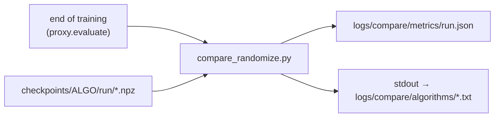

# `scripts/` — sim2real robustness (SRR) evaluation

Utilities that run outside the training loop: score a checkpoint under dynamics and
observation perturbations, and recover runs that died at the end of training.

## Pipeline



`run_srr_eval.sh` loops over `compare_randomize.py` with a resume policy. Every JAX
training run also performs this evaluation on its `checkpoint_final.npz`
(`algorithms/utils/proxy.py`), and the JSON lands in the same `logs/compare/metrics/`.

### Supported envs

Observation perturbations are applied in place to the slices that `OBS_LAYOUTS`
(`algorithms/utils/randomize_gym.py`) maps for each env (gyro, gravity, joint positions
and joint velocities). Command, phase, goal and last action are left untouched. All nine
benchmark envs have a layout:

`Go2JoystickFlatTerrain`, `Go2PushRecovery`, `Go2RoughCurriculum`, `Go2Getup`,
`Go2GetupWalk`, `Go2Footstand`, `Go2Handstand`, `G1JoystickFlatTerrain`,
`H1JoystickGaitTracking`.

On H1, the one-step `qvel`/`qpos_error` history is a clean copy of the same readings, so
it gets the same perturbation (*mirrors*). An env with no layout, or whose observation
size doesn't match its layout, is rejected with an error. To validate a new layout, use
[`check_randomize_envs.py`](#check_randomize_envspy).

## Prerequisites

| Item | Notes |
| --- | --- |
| `MINARI_DATASETS_PATH` | Must point to `CORL/datasets` to resolve `playground/...`. `run_srr_eval.sh` exports it. |
| GPU / EGL | `compare_randomize.py` forces `MUJOCO_GL=egl` and creates the GL context before importing JAX. |
| `scipy` | SRR bootstrap CIs (`uv sync --group stats`). |
| W&B login | Only for `recover_proxy.py`, which resumes the training run in W&B. |

---

## `compare_randomize.py`

Scores a checkpoint on each selected randomization suite and writes a JSON with the
metrics and the per-episode returns.

```bash
export MINARI_DATASETS_PATH="$PWD/datasets"
uv run python -m scripts.compare_randomize \
  --checkpoint_path checkpoints/BC/BC-Go2JoystickFlatTerrain-1a2b3c4d \
  --device cuda --n_actors 50 --n_episodes 100 \
  --configs humanoid_gym_relative
```

### Flags

| Flag | Default | Description |
| --- | --- | --- |
| `--checkpoint_path` | — | Run directory **or** a specific `.npz` (to sweep intermediate checkpoints). For a directory, uses `checkpoint_final.npz`, else the highest step. |
| `--checkpoint_config` | `None` | Alternative `config.yaml`. Without it, reads the `config.yaml` next to the checkpoint. |
| `--n_actors` | `4` | Vectorized envs (capped at `n_episodes`). Fewer batches = faster. |
| `--n_episodes` | `20` | Episodes per suite. |
| `--seed` | `0` | — |
| `--render` | `False` | Saves a video to `videos/<checkpoint>/<suite>-<timestamp>.mp4`. |
| `--device` | `cuda` | — |
| `--configs` | `None` (all) | Comma-separated list of suites. `default` is **always** included as the baseline. |
| `--metrics_dir` | `logs/compare/metrics` | Where the JSON is written. |
| `--dt_target_return` | `None` | DT only: overrides `target_returns[0]` from the run config. |

`env`, `command_type`, `dataset_id` and `seed` are read from the checkpoint's
`config.yaml` (DT calls the first one `env_name`; both names are accepted). The actor
architecture is **not** read from the config; it comes from the weights themselves. The
one exception is DT, whose transformer can't be rebuilt from the weight tree, so
`seq_len`, `episode_len`, `reward_scale`, `target_returns`, `embedding_dim`,
`num_layers`, `num_heads` and the three dropouts are read too.

### Available suites

| Name | Source | Role |
| --- | --- | --- |
| `default` | nominal env | SRR baseline (with the env's native sensor noise). |
| `disabled` | no noise | Noise floor of the protocol. |
| `full`, `only_domain` | Playground randomizer | Too weak for a stress test. `only_domain` uses `disabled` as its baseline. |
| `example` | `configs/randomize/example.yaml` | Example suite. |
| `humanoid_gym` | `configs/randomize/humanoid_gym.yaml` | "Strong" level: the training ranges of Humanoid-Gym (Gu et al., 2024), Table III. |
| `humanoid_gym_medium` | `configs/randomize/humanoid_gym_medium.yaml` | "Medium" level with absolute ranges, calibrated on the Go2. |
| `humanoid_gym_relative` | `configs/randomize/humanoid_gym_relative.yaml` | **Default SRR suite** (`run_srr_eval.sh` and the training proxy). |

`humanoid_gym_relative` is `humanoid_gym_medium` with its physical ranges expressed
relative to the robot, so a single suite has comparable strength on Go2, G1 and H1:

- **friction**: a `U(0.5, 1.667)` scale of the env's default floor friction (on the Go2,
  μ = 0.6, this is exactly `medium`'s absolute `U(0.3, 1.0)`);
- **payload**: ±6.576% of the total mass on body 1 (`additive_total` type), i.e. ±1.0 kg
  on the Go2, ±2.2 kg on the G1 and ±3.4 kg on the H1;
- motor strength, sensor noise (absolute, in rad and rad/s) and the 0–1 control-step
  delay are the same as `medium`.

On the Go2 envs both suites sample the same distributions.

### Per-suite metrics

`score`, `score_std`, `score_median`, `n_episodes`, `srr` (= score / baseline), `gap`,
`delta_mean`, `p5_delta`, `p5_retention`, `critical_rate_10`, `critical_rate_50`,
`srr_ci_low`, `srr_ci_high` (paired bootstrap, 1000 resamples, requires `scipy`).

The score is D4RL-normalized (`return_min`/`return_expert` from the Minari metadata, on a
0–1 scale) when the config has a `dataset_id`; without one, scores are raw returns and
the script warns.

> **Ratio metrics need a policy that learned the task.** When the `default` score is
> below about 0.05, every ratio metric degenerates: a policy that fails **equally** in
> both conditions gets SRR 1.0, and with a baseline ≈ 0 or negative the ratio blows up or
> flips sign. Leave those runs out before comparing SRR.

### Output

`logs/compare/metrics/<run>.json`, where `<run>` is the checkpoint directory name, or
`<directory>@<step>` when the target is an intermediate `.npz`. The JSON also stores
`episode_returns` per suite, so metrics can be recomputed without simulating again.

### Policy reconstruction (sensitive)

`build_policy` rebuilds a deterministic actor **from the weight tree**, dispatching on
structure rather than on the directory name:

| Detection | Algorithm | Forward |
| --- | --- | --- |
| `policy_params` key | CQL | `base_network` → `split(out, 2)` → `tanh(mean)` |
| `log_stds` in params | IQL / AWAC | `MLP_0` with ReLU on every layer → `Dense_0` → `clip(mean, -1, 1)` |
| otherwise | BC / TD3+BC | `MLP_0` → `clip(max_action * tanh(x), -1, 1)` |

> **Warning:** BC, TD3-BC, AWAC and IQL all use the `actor_params` key. Loading every one
> of them with the BC architecture raises **no error** (Flax ignores params it doesn't ask
> for) and silently produces wrong results. Any refactor here must be revalidated against
> `sim2real/checkpoint_{bc,td3_bc,iql,awac}.py`.

### Decision Transformer

A `transformer_params` key in the `.npz` routes to `build_dt_policy`, which rebuilds
`dt_jax`'s `DecisionTransformer` with the hyperparameters from the run's `config.yaml`
and normalizes with `state_mean`/`state_std` (not `obs_mean`/`obs_std`).

The rollout (`_rollout_dt`) is autoregressive and mirrors `dt_jax.evaluate`: a sliding
window of `seq_len` over (timesteps, states, actions, returns-to-go), RTG initialized to
`target_return * reward_scale` and **decremented by the observed reward at every step**,
and state normalization **without epsilon**. All three details must match training.

> The `proxy.evaluate` call at the end of each training run uses this same
> `compare_randomize` (`default` + `humanoid_gym_relative`, 100 episodes / 50 actors) on
> `checkpoint_final.npz`, so the `eval/proxy_results/*` metrics in W&B are the same as
> the JSON.

---

## `run_srr_eval.sh`

Walks `checkpoints/<ALGO>/<ALGO>-<ENV>-*/` and scores each run. Resume is keyed on the
metrics JSON (written only at the end, so an interrupted run is redone).

```bash
ALGOS="IQL CQL" EPISODES=50 ./scripts/run_srr_eval.sh
```

| Variable | Default |
| --- | --- |
| `ALGOS` | `BC AWAC CQL IQL TD3-BC DT` |
| `ENVS` | the nine envs in [Supported envs](#supported-envs) |
| `SUITE` | `humanoid_gym_relative` |
| `EPISODES` | `100` |
| `ACTORS` | `50` |
| `REPO_ROOT` | repo root (derived from the script's path) |

Outputs: `logs/compare/metrics/*.json` and text logs in `logs/compare/algorithms/`.

---

## `recover_proxy.py`

Finishes runs that trained to completion but died in the end-of-training proxy evaluation
(for example, no `ffmpeg` on the node when saving the video), before logging the metrics
and saving `checkpoint_final.npz`. Nothing is retrained.

```bash
uv run python -m scripts.recover_proxy logs/matrix/bc-go2-footstand-medium-seed2.log [...]
```

For each training log (`<algo>-<task>-<difficulty>-seed<N>.log`), it:

1. promotes the last periodic checkpoint to `checkpoint_final.npz`, **only** if its step
   is the final training step (otherwise the run is considered unfinished and fails);
2. runs `proxy.evaluate`, or reuses the JSON in `logs/compare/metrics/` if it was written
   after the final checkpoint with the same suite and budget (100 episodes / 50 actors);
3. resumes the **same** W&B run (URL and `Checkpoints path` read from the log), logs
   `eval/proxy_results/*` and the rollout video, and finishes the run;
4. creates `.done_runs/<group>-seed<N>.done`, so the runner skips that training.

`run_offline_all.sh` calls this script on its own when a training run ends without the
SRR JSON; running it by hand is only needed for logs from older sweeps.

Supports the MLP trainers and DT (the DT video isn't re-recorded). `--device` defaults to
`cuda`. Exits with status 1 if any log fails.

---

## `check_randomize_envs.py`

Validates the `humanoid_gym_relative` suite on every env in `OBS_LAYOUTS`. Run it after
adding or changing a layout.

```bash
uv run python -m scripts.check_randomize_envs
uv run python -m scripts.check_randomize_envs --envs Go2Getup H1JoystickGaitTracking
```

For each env:

1. **layout**: with the env's own sensor noise off, every `OBS_LAYOUTS` slice (and mirror)
   equals the simulator quantity it claims to hold;
2. **obs**: the suite perturbs exactly the mapped slices, leaves every other entry
   untouched and moves each mirror by the same amount;
3. **domain**: friction, payload and motor strength stay inside the suite's relative
   ranges and change nothing else;
4. **rollout**: the `GymWrapper` runs the suite end to end with finite observations.

It's CPU-heavy (JIT + MJX rollouts); on a cluster, run it as a batch job.
