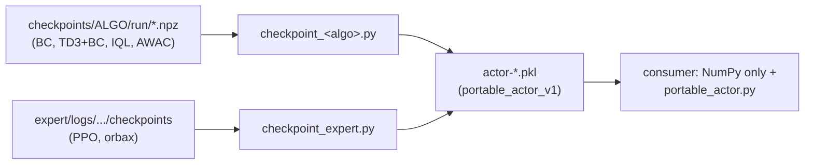

# `sim2real/` — exporting actors for deployment

Converts checkpoints trained with CORL (JAX/Flax) and the PPO experts (Brax/orbax) into
**portable actors**: a `.pkl` that holds only data (NumPy weights plus a small spec) and
runs anywhere with nothing but **NumPy** installed. This is the format used by the Isaac
evaluation and by inference on the real robot.

## Why a portable format

The old format used `cloudpickle` to serialize the JAX-compiled `get_action` closure. That
tied every consumer to the exact Python, JAX, Flax and distrax versions used at export
time. `portable_actor.py` stores only the data and rebuilds the forward pass in NumPy on
load, so the file works across Python and library versions.



## Files

| File | Role |
| --- | --- |
| `portable_actor.py` | The `portable_actor_v1` format: `PortableActor` class, `save_actor` / `load_actor` and helpers to extract Flax weights. Depends only on NumPy. |
| `checkpoint_bc.py` | Exports a BC run. |
| `checkpoint_td3_bc.py` | Exports a TD3+BC run. |
| `checkpoint_iql.py` | Exports an IQL run. |
| `checkpoint_awac.py` | Exports an AWAC run. |
| `checkpoint_expert.py` | Exports a PPO expert orbax checkpoint (`expert/`). |
| `evaluate_actor.py` | Runs a `.pkl` in simulation, records the mean return and, optionally, a video. |
| `generate_checkpoints.sh` | Exports any number of runs (offline or PPO expert), reading the env and its sizes from each run. |
| `evaluate_actor.sh` | Evaluates any number of exported actors and records a video of each. |
| `requirements_minimum.txt` | Dependencies for loading **legacy** (cloudpickle) `.pkl` files. The portable format doesn't need them. |

CQL and DT have no exporter.

---

## Exporting a checkpoint

The simplest way is `generate_checkpoints.sh`, which takes run directories, picks the
right exporter, and reads the env, observation size and action size from each run:

```bash
./sim2real/generate_checkpoints.sh \
  checkpoints/BC/BC-Go2Getup-1a2b3c4d \
  checkpoints/IQL/IQL-G1JoystickFlatTerrain-5e6f7a8b \
  expert/logs/Go2Getup-20260626-171404
```

Offline runs (BC, TD3-BC, IQL, AWAC) are detected by their `config.yaml`; PPO expert runs
by their `checkpoints/` folder, using the latest step unless `STEP=<n>` is set. The
`.pkl` files are written to the current directory.

### Calling an exporter directly

The scripts import `portable_actor` from their own directory and write the `.pkl` to the
current directory. Run them from inside `sim2real/`:

```bash
cd sim2real
../.venv/bin/python checkpoint_bc.py \
  --checkpoint-path ../checkpoints/BC/BC-Go2JoystickFlatTerrain-1a2b3c4d \
  --env-name Go2JoystickFlatTerrain
```

`checkpoint_td3_bc.py`, `checkpoint_iql.py` and `checkpoint_awac.py` take the same flags.

| Flag | Default | Description |
| --- | --- | --- |
| `--checkpoint-path` | — | Run directory. Uses `checkpoint_final.npz`, else the highest step (AWAC requires `checkpoint_final.npz`). |
| `--env-name` | — | Only used in the file name and metadata. |
| `--state-dim` | `48` | Observation size. |
| `--action-dim` | `12` | Action size. |
| `--max-action` | `1.0` | — |

> The `48` / `12` defaults are the Go2 joystick ones. For other envs, pass the env's
> sizes (Go2Getup: 42 / 12, Go2Handstand and Go2Footstand: 45 / 12, G1: 103 / 29,
> H1: 113 / 19). `generate_checkpoints.sh` does this for you.

The hidden layers come from the run's `config.yaml`: `hidden_dims` (default `256, 256`)
for BC, TD3+BC and IQL; `actor_hidden_dims` (required) for AWAC. After saving, the script
reloads the `.pkl` and compares the portable actor's action with the original JAX actor's
on a random observation (`Actions match: True`).

### PPO expert

```bash
cd sim2real
../.venv/bin/python checkpoint_expert.py \
  --checkpoints-dir ../expert/logs/Go2JoystickFlatTerrain-20260626-120000/checkpoints \
  --checkpoint-step 1008599040 \
  --run-id 20260626-120000-1008599040 \
  --env-name Go2JoystickFlatTerrain
```

`--checkpoints-dir` is the folder holding the numbered orbax subfolders, and
`--checkpoint-step` picks one of them (without it, the latest is used). `--run-id` is only
used in the file name. The network is assumed to be the default Brax PPO one, with a
`(512, 256, 128)` policy reading the `state` key. This exporter doesn't run the
round-trip check.

### Output

| Script | File |
| --- | --- |
| BC | `actor-BC-<env>-<hash>.pkl` |
| TD3+BC | `actor-TD3BC-<env>-<hash>.pkl` |
| IQL | `actor-IQL-<env>-<hash>.pkl` |
| AWAC | `actor-<run name>.pkl` (e.g. `actor-AWAC-Go2JoystickFlatTerrain-b1f58c5a.pkl`) |
| PPO | `actor-PPOExpert-<env>-<run-id>.pkl` |

`*.pkl` is in `.gitignore`.

---

## Using an exported actor

The consumer only needs NumPy and a copy of `portable_actor.py`:

```python
from portable_actor import load_actor

actor = load_actor("actor-BC-Go2JoystickFlatTerrain-1a2b3c4d.pkl")
action = actor["get_action"](obs=obs)   # or actor(obs=obs)
```

- `obs` can be a 1-D vector, a 2-D batch or a Brax-style mapping (`{"state": ...}`).
- Observation normalization is built into the actor: pass the env's raw observation.
- `actor["obs_mean"]`, `actor["obs_std"]` and the metadata keys (`algo`, `env_name`,
  `state_dim`, `action_dim`, `max_action`) are still available dict-style, as with the
  old `.pkl` files.
- `load_actor` also opens legacy `.pkl` files (a dict with `get_action`). In that case,
  the consumer needs the dependencies in `requirements_minimum.txt`.

### Rebuilt forward pass

```
x = (obs - obs_mean) / (obs_std + obs_norm_eps)
hidden layers: x = activation(x @ W + b)
last layer:    x = x @ W + b
action = output(x)
```

| Algorithm | Activation | Output | `obs_norm_eps` |
| --- | --- | --- | --- |
| BC, TD3+BC | ReLU | `max_action * tanh(x)` | `1e-5` |
| IQL, AWAC | ReLU | `clip(x, -1, 1)` (Gaussian mean) | `1e-5` |
| PPO expert | swish | `tanh(x[:action_dim])` | `0` (Brax's `std` already includes the epsilon) |

The format also supports LayerNorm between layers and observation clipping, but none of
the current exporters use them.

---

## Evaluating in simulation

`evaluate_actor.sh` evaluates exported actors, reading each one's env from its metadata,
and records a video of each:

```bash
./sim2real/evaluate_actor.sh actor-*.pkl
COMMAND_TYPE=forwardfixed N_EPISODES=5 ./sim2real/evaluate_actor.sh actor-BC-Go2JoystickFlatTerrain-1a2b3c4d.pkl
```

Settings: `N_EPISODES` (default 20), `COMMAND_TYPE` (joystick command), `VIDEO_DIR`
(default `./videos`) and `RANDOMIZE=1` (Playground domain randomizer).

To call the evaluator directly:

```bash
cd sim2real
../.venv/bin/python evaluate_actor.py \
  --pickle-path actor-BC-Go2JoystickFlatTerrain-1a2b3c4d.pkl \
  --env-name Go2JoystickFlatTerrain \
  --command-type forward_realrobot \
  --save-video --video-dir ./videos
```

It also runs from any other directory (or as `python -m sim2real.evaluate_actor` from the
repo root). It accepts both the portable format and legacy `.pkl` files.

| Flag | Default | Description |
| --- | --- | --- |
| `--pickle-path` | — | The actor `.pkl`. |
| `--env-name` | — | Playground env. |
| `--n-episodes` | `20` | — |
| `--command-type` | `direction` | Joystick command (`forward`, `forwardfixed`, `forward_realrobot`, ...). |
| `--randomize` | `False` | Turns on the Playground domain randomizer. |
| `--render` | `False` | Calls `env.render()` at every step of the first episode. |
| `--save-video` | `False` | Writes the first episode to `<.pkl name>.mp4` (implies `--render`). |
| `--video-dir` | the `.pkl`'s folder | Where the video is written. |

Each run appends the mean and std of the returns (not D4RL-normalized) to
`results_evaluate_actor.json` in the current directory.

To measure robustness with the benchmark suites, run `scripts/compare_randomize.py` on the
original checkpoint (see [scripts/README.md](../scripts/README.md)).
